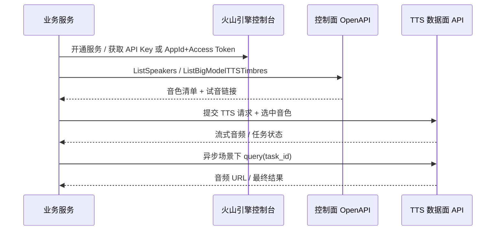

# 火山引擎 Volcengine 官方 TTS API 实操手册

## 执行摘要

火山引擎当前与 TTS 直接相关、且能从官方目录稳定定位到的文档，实际上分成两层：一层是**控制面**，用来管理音色与凭证，例如 `ListSpeakers`、`ListBigModelTTSTimbres`、`ListAPIKeys`、`CreateAPIKey`；另一层是**数据面**，真正把文本转成音频，主要是 **HTTP Chunked/SSE 单向流式 V3**、**WebSocket 单向/双向流式 V3**，以及**异步长文本接口**。官方目录中已经把这些文档并列列出；其中 V3 文档明确推荐新版控制台的 `X-Api-Key` 鉴权方式，长文本接口则保留了旧式 `Authorization + Resource-Id` 的调用模型。 citeturn38search4turn42search0turn42search1turn40search2

对工程师来说，最稳妥的落地路径是这样的：先在控制台拿到 **API Key** 或旧版 **AppId/Access Token**；再通过 `ListSpeakers` 拉取你账号**当前真正可用**的音色清单，并直接读取 `trial_url` / `short_trial_url` 作为试音链接；如果你还需要按情感查看示例音频，则补充调用 `ListBigModelTTSTimbres`，它会返回 `emotions[].demo_url` 与 `demo_text`；实时场景优先走 V3 流式 API，长篇内容或批量任务则走异步长文本接口。异步长文本官方说明支持单次 **10 万字符**，合成结果在服务端保留 **7 天**，通常数十分钟返回，最长约 **3 小时**，提交频率限制为 **10 QPS**。 citeturn21view0turn23view0turn23view6turn26view2turn40search2turn41search0

如果你只记三件事，记这三件：第一，**新版控制台优先用 API Key**，并把 `X-Api-Resource-Id` 设成与你的模型版本一致，比如 `seed-tts-2.0`；第二，**音色不要手填猜测**，而是通过 `ListSpeakers` 实时拉取；第三，**长文本不要硬塞进实时接口**，超过实时场景应转异步或自行分片。WebSocket 单向流式 V3 的官方摘要还特别提到，**链接复用**通常可再降低约 **70ms** 的耗时。 citeturn38search1turn42search0turn42search1turn41search0

| 你要完成的事 | 最推荐做法 | 关键输入 | 关键输出 |
|---|---|---|---|
| 获取凭证 | 新版控制台创建或查看 API Key；旧版控制台查看 AppId / Access Token | 控制台权限 | `API Key` 或 `AppId + Access Token` |
| 列全部音色 | 调 `ListSpeakers` 分页拉全量；必要时补 `ListBigModelTTSTimbres` | AK/SK 或控制面 SDK | 全量音色对象、试音链接 |
| 选中音色 | 旧接口用 `voice_type`；V3 实战通常用 `speaker`，并配 `X-Api-Resource-Id` | 音色 ID / Speaker ID | 目标音色被选中 |
| 生成短文本语音 | V3 HTTP Chunked/SSE 或 WebSocket | 文本、音色、格式、采样率 | 流式音频 |
| 生成长文本 | 异步长文本 submit + query | 文本、格式、音色、回调可选 | `task_id`、最终音频 URL |
| 排障 | 先查授权、资源开通、QPS/并发、音色权限 | `reqid` / 请求头 / quota | 明确故障点 |

## 文档范围与接口版图

从官方目录看，火山引擎“豆包语音”下与语音合成直接相关的页面至少包括：**音色列表**、**HTTP Chunked/SSE 单向流式 V3**、**WebSocket 单向流式 V3**、**WebSocket 双向流式 V3**、**异步长文本接口文档**，以及控制面 OpenAPI：**ListSpeakers**、**ListBigModelTTSTimbres**、**ListAPIKeys**、**CreateAPIKey**、**DeleteAPIKey**、**UpdateAPIKey**、**QuotaMonitoring**、**UsageMonitoring**。这意味着你实际接入时，必须同时面对“控制面 + 数据面”两套 API，而不是一篇文档就能闭环。 citeturn38search4turn14view0turn40search1turn40search0

V3 数据面的关键区别在于：**鉴权与资源标识被拆到 Header**。官方 V3 文档摘要明确写到，新版控制台推荐用 `X-Api-Key`，旧版控制台则用 `X-Api-App-Id` 与 `X-Api-Access-Key`；无论新旧，`X-Api-Resource-Id` 都是必带项，用来决定模型版本与计费方式。对 TTS 来说，`seed-tts-2.0` 仅支持“豆包语音合成模型 2.0”的音色，`seed-tts-1.0` / `seed-tts-1.0-concurr` 仅支持 1.0 音色；对 ICL 声音复刻则对应 `seed-icl-*`。 citeturn33search1turn36search1

控制面 OpenAPI 的证据则来自官方 Python SDK 的 `speechsaasprod` 服务定义：`list_speakers()` 对应 `/ListSpeakers/2025-05-20/speech_saas_prod/post/application_json/`；`list_big_model_tts_timbres()` 对应 `/ListBigModelTTSTimbres/2025-05-20/speech_saas_prod/post/application_json/`；`create_api_key()`、`list_api_keys()` 也都存在对应路径，并统一走 `volcengineSign` 鉴权。这一层主要解决“我有哪些音色 / 我有哪些 key / 哪些资源启用了服务”这些管理问题。 citeturn14view0turn13view0



## 音色清单获取与选型

最重要的官方事实是：**新版音色列表不应靠手抄表，而应靠 `ListSpeakers` 实时拉取**。官方 Python SDK 模型已经把这个接口的输入输出字段写得很清楚：`ListSpeakersRequest` 支持 `limit`、`page`、`resource_ids`、`voice_types` 四个字段；`ListSpeakersResponse` 返回 `speakers` 和 `total`。`speakers[]` 中每个对象包含 `name`、`resource_id`、`voice_type`、`gender`、`languages`、`description`、`trial_url`、`short_trial_url`、`normal_labels`、`special_labels` 等字段。对于“如何拿到每个音色的示例音频链接”这个问题，答案已经在返回对象里：**直接读 `trial_url` 或 `short_trial_url`**。 citeturn21view0turn21view1turn23view0turn23view2turn23view3turn23view4

如果你还需要“同一音色在不同情感下的示例音频”，则可补充调用 `ListBigModelTTSTimbres`。这个接口的官方 SDK 模型显示它**没有请求体字段**；返回对象中 `timbres[]` 每项含 `speaker_id` 与 `timbre_infos[]`，而 `timbre_infos[].emotions[]` 进一步包含 `demo_url`、`demo_text`、`emotion`、`emotion_type`。因此，**`ListSpeakers` 更适合做当前账号可用音色总表**，**`ListBigModelTTSTimbres` 更适合做“情感试音库”**。需要注意的是，当前公开抓取到的官方 SDK 模型**没有明确说明** `ListSpeakers` 与 `ListBigModelTTSTimbres` 两套结果的稳定 Join Key；不要在生产里未经验证就把 `resource_id`、`voice_type`、`speaker_id` 强行一一对应。 citeturn23view5turn23view6turn26view0turn26view1turn26view2

下面这张表，是你在工程里真正应该依赖的“字段对照表”。

| 接口 | 用途 | 你最该读的字段 | 能否直接拿到示例音频 |
|---|---|---|---|
| `ListSpeakers` | 拉当前账号**全部可用音色** | `name`、`resource_id`、`voice_type`、`gender`、`languages[]`、`trial_url`、`short_trial_url` | 可以，读 `trial_url` / `short_trial_url` |
| `ListBigModelTTSTimbres` | 拉**情感/风格示例** | `speaker_id`、`timbre_infos[].speaker_name`、`emotions[].demo_url`、`demo_text`、`emotion` | 可以，读 `emotions[].demo_url` |
| `ListSpeakersRequest` | 分页与筛选 | `limit`、`page`、`resource_ids[]`、`voice_types[]` | 不适用 |
| `ListAPIKeys` | 拉 API Key 列表 | `api_keys[].api_key`、`disable`、`create_time` | 不适用 |

上表字段均来自官方 `speechsaasprod` SDK 模型定义。 citeturn21view0turn23view0turn23view2turn23view3turn23view4turn23view5turn23view6turn26view0turn26view1turn26view2turn58view0

下面这段 Python 代码是最实用的“实时导出全部音色表”脚本。它基于官方 Python SDK 的 `ListSpeakersRequest` 与 `SPEECHSAASPRODApi.list_speakers()`；官方 FAQ 还说明 Python SDK 的响应对象默认用**下划线命名**，可以直接 `.to_dict()` 使用。由于官方 README 明确提示 `volcengine-python-sdk` 的 **4.0.1–4.0.42** 历史版本存在内置重试缺陷，建议至少使用 **4.0.43**。 citeturn21view0turn21view1turn15search1turn12view3

```python
# pip install "volcengine-python-sdk>=4.0.43"

import csv
import json
import os

import volcenginesdkcore
from volcenginesdkcore.rest import ApiException
from volcenginesdkspeechsaasprod.api.speech_saas_prod_api import SPEECHSAASPRODApi
from volcenginesdkspeechsaasprod.models.list_speakers_request import ListSpeakersRequest

AK = os.environ["VOLC_AK"]
SK = os.environ["VOLC_SK"]
REGION = os.getenv("VOLC_REGION", "cn-beijing")

def flatten_languages(languages):
    if not languages:
        return ""
    vals = []
    for item in languages:
        d = item.to_dict() if hasattr(item, "to_dict") else dict(item)
        vals.append(d.get("language") or d.get("text") or json.dumps(d, ensure_ascii=False))
    return " | ".join(vals)

def main():
    cfg = volcenginesdkcore.Configuration()
    cfg.ak = AK
    cfg.sk = SK
    cfg.region = REGION
    volcenginesdkcore.Configuration.set_default(cfg)

    api = SPEECHSAASPRODApi()

    page = 1
    limit = "100"   # 官方 SDK 模型里 limit 的类型就是 str
    rows = []

    while True:
        req = ListSpeakersRequest(limit=limit, page=page)
        resp = api.list_speakers(req)

        speakers = resp.speakers or []
        for s in speakers:
            d = s.to_dict()
            rows.append({
                "name": d.get("name", "未指定"),
                "resource_id": d.get("resource_id", "未指定"),
                "voice_type": d.get("voice_type", "未指定"),
                "gender": d.get("gender", "未指定"),
                "languages": flatten_languages(s.languages),
                "trial_url": d.get("trial_url", "未指定"),
                "short_trial_url": d.get("short_trial_url", "未指定"),
                "description": d.get("description", "未指定"),
            })

        total = resp.total or 0
        if page * int(limit) >= total or not speakers:
            break
        page += 1

    with open("volc_tts_speakers.csv", "w", newline="", encoding="utf-8-sig") as f:
        writer = csv.DictWriter(f, fieldnames=list(rows[0].keys()) if rows else [
            "name", "resource_id", "voice_type", "gender", "languages",
            "trial_url", "short_trial_url", "description"
        ])
        writer.writeheader()
        writer.writerows(rows)

    print(f"已导出 {len(rows)} 条音色到 volc_tts_speakers.csv")

if __name__ == "__main__":
    try:
        main()
    except ApiException as e:
        print("API 异常:", e)
        raise
    except Exception as e:
        print("执行失败:", e)
        raise
```

为了满足“报告里给一个表格”的要求，下面再补一张**官方公开检索片段中可稳定还原**的旧版静态音色表。请注意，这张表**不是你账号当前“全部可用音色”的权威来源**；当前实时可用音色，应以上面的 `ListSpeakers` 实时导出为准。此处参数值按旧版官方支持页原样保留 `VC_` 前缀；而当前文档、FAQ 与错误示例中，也能看到不带前缀的 `BV001_streaming` / `BV701_streaming` 等写法，因此如果两者不一致，请以**控制台、`ListSpeakers` 返回值和你具体接口页面**为准。官方公开资料还说明：当前音色能力覆盖 **28 种情感/风格、8 国语言、11 种方言**；其中 **BV701 擎苍** 支持笑声、哭腔、咳嗽。 citeturn56search0turn45search0turn48search0turn31search1

| 名称 | id/参数值 | 性别 | 语言 | 示例链接 | 备注 |
|---|---|---:|---|---|---|
| 通用女声 | `VC_BV001_streaming` | 女 | 未指定 | 未指定 | 支持歌唱 |
| 阳光男声 | `VC_BV056_streaming` | 女 | 未指定 | 未指定 | 官方检索片段显示可歌唱；性别列疑似有索引误差 |
| 动漫小新 | `VC_BV050_streaming` | 男 | 未指定 | 未指定 | 旧版静态表 |
| 奶气萌娃 | `VC_BV051_streaming` | 男 | 未指定 | 未指定 | 旧版静态表 |
| 灿灿 | `VC_BV700_streaming` | 女 | 未指定 | 未指定 | 旧版静态表 |
| 擎苍 | `VC_BV701_streaming` | 女 | 未指定 | 未指定 | 官方 FAQ 说明支持笑声、哭腔、咳嗽 |
| TVB女声 | `VC_BV409_streaming` | 女 | 未指定 | 未指定 | 旧版静态表 |
| 小萝莉 | `VC_BV064_streaming` | 女 | 未指定 | 未指定 | 支持歌唱 |
| 甜美小源 | `VC_BV405_streaming` | 女 | 未指定 | 未指定 | 支持歌唱 |
| 超自然音色-梓梓 | `VC_BV406_streaming` | 女 | 未指定 | 未指定 | 旧版静态表 |
| 超自然音色-燃燃 | `VC_BV407_streaming` | 女 | 未指定 | 未指定 | 旧版静态表 |
| 译制片男声 | `VC_BV408_streaming` | 男 | 未指定 | 未指定 | 旧版静态表 |
| 说唱小哥 | `VC_BR001_streaming` | 男 | 未指定 | 未指定 | 旧版静态表 |
| 开朗青年 | `VC_BV004_streaming` | 男 | 未指定 | 未指定 | 旧版静态表 |
| 活泼女声 | `VC_BV005_streaming` | 女 | 未指定 | 未指定 | 旧版静态表 |
| 磁性男声 | `VC_BV006_streaming` | 男 | 未指定 | 未指定 | 旧版静态表 |
| 知性女声 | `VC_BV009_streaming` | 女 | 未指定 | 未指定 | 旧版静态表 |
| 新闻女声 | `VC_BV011_streaming` | 女 | 未指定 | 未指定 | 旧版静态表 |
| 温柔小哥 | `VC_BV033_streaming` | 男 | 未指定 | 未指定 | 旧版静态表 |
| 知性姐姐-双语 | `VC_BV034_streaming` | 女 | 未指定 | 未指定 | 名称显示双语 |
| 活泼幼教-双语 | `VC_BV057_streaming` | 女 | 未指定 | 未指定 | 名称显示双语 |
| 天才童声 | `VC_BV061_streaming` | 男 | 未指定 | 未指定 | 旧版静态表 |
| 动漫海绵 | `VC_BV063_streaming` | 男 | 未指定 | 未指定 | 旧版静态表 |
| 质朴青年 | `VC_BV100_streaming` | 男 | 未指定 | 未指定 | 旧版静态表 |
| 儒雅青年 | `VC_BV102_streaming` | 男 | 未指定 | 未指定 | 旧版静态表 |
| 温柔淑女 | `VC_BV104_streaming` | 女 | 未指定 | 未指定 | 旧版静态表 |
| 霸气青叔 | `VC_BV107_streaming` | 男 | 未指定 | 未指定 | 旧版静态表 |
| 甜宠少御 | `VC_BV113_streaming` | 女 | 未指定 | 未指定 | 旧版静态表 |
| 古风少御 | `VC_BV115_streaming` | 女 | 未指定 | 未指定 | 旧版静态表 |
| 通用赘婿 | `VC_BV119_streaming` | 男 | 未指定 | 未指定 | 旧版静态表 |
| 反卷青年 | `VC_BV120_streaming` | 男 | 未指定 | 未指定 | 旧版静态表 |
| 阳光青年 | `VC_BV123_streaming` | 男 | 未指定 | 未指定 | 旧版静态表 |
| 西安佟掌柜 | `VC_BV210_streaming` | 女 | 未指定 | 未指定 | 方言/角色向音色 |
| 北京小伙儿 | `VC_BV222_streaming` | 男 | 未指定 | 未指定 | 方言/角色向音色 |
| 影视解说小帅 | `VC_BV411_streaming` | 男 | 未指定 | 未指定 | 旧版静态表 |
| 动漫海星 | `VC_BV417_streaming` | 男 | 未指定 | 未指定 | 旧版静态表 |
| 懒小羊 | `VC_BV426_streaming` | 男 | 未指定 | 未指定 | 旧版静态表 |
| 容嬷嬷 | `VC_BV430_streaming` | 女 | 未指定 | 未指定 | 角色向音色 |
| 天真萌娃-Lily | `VC_BV506_streaming` | 女 | 未指定 | 未指定 | 旧版静态表 |
| 慵懒女声-Ava | `VC_BV511_streaming` | 女 | 未指定 | 未指定 | 旧版静态表 |

上表全部行数据均来自官方旧版支持页被公开检索到的静态表格；它更适合帮助你快速建立“音色命名体系”心智，而不是替代 `ListSpeakers` 的实时导出。 citeturn56search0turn48search0

## 密钥与控制台配置

火山引擎现在推荐你直接在**新版控制台 API Key 管理页**拿 `API Key`。官方 “API Key 使用” 文档摘要写得很直白：你可以在控制台看到自己的 API Key，也可以通过 `ListAPIKeys` 拉取；真正调用数据面接口时，只需要在 Header 中带 `x-api-key`，**不再需要填写 appid**。如果怀疑 key 泄露，可以在控制台上**禁用或删除**，或调用 `UpdateAPIKey` / `DeleteAPIKey` 对应接口。 citeturn38search1

如果你使用的是旧版控制台或仍在接老接口，官方 FAQ 的 Q1 明确提到：开通服务之后，可以在相应页面查看 `appid`、`cluster`、`token`、`authorization_type`、`secret_key` 等参数。对 TTS 旧控制台，官方示例工程和官方 Demo README 公开显示的控制台路由是“语音合成服务页”；此外，全局 **AK/SK** 来自 IAM 的**密钥管理**页面。若你是主账号下的子账号，官方 FAQ 的 Q4 明确要求主账号为子账号授予**语音技术系统策略**后，子账号才能访问语音控制台。官方公开检索片段**未指定**创建 AK/SK 所需更细粒度 IAM 策略名。 citeturn38search0turn44search0

控制面 API Key 的 OpenAPI 也已经是官方 SDK 的一部分：`CreateAPIKeyRequest` 的请求体字段只有 `name` 与 `project_name`；`ListAPIKeysRequest` 支持 `only_available` 与 `project_name`；`ListAPIKeysResponse` 则返回 `api_keys[]` 以及分页字段 `max_results`、`next_token`、`page_number`、`page_size`、`total_count`。每个 `api_keys[]` 项还包含真实的 `api_key`、`create_time`、`disable`、`id`、`name`、`update_time`。一个很实用的工程结论是：由于官方 Python SDK 中 `CreateAPIKeyResponse` 模型是空对象，**创建后再调用一次 `ListAPIKeys` 获取实际 key 值**会更稳妥。这个结论是基于官方 SDK 模型做出的工程推断。 citeturn22view6turn22view7turn22view8turn22view9turn58view0

下面给出一组可直接落地的环境变量约定。这里分成两套：**控制面 AK/SK** 与 **数据面 API Key**。其中 Node 官方 SDK 已明确支持从环境变量读取 `VOLCSTACK_ACCESS_KEY_ID` / `VOLCSTACK_SECRET_ACCESS_KEY`；`VOLC_TTS_*` 这组是工程约定示例，不是官方保留变量名。 citeturn51search0

```bash
# 控制面：OpenAPI / 官方 SDK（推荐用 AK/SK）
export VOLCSTACK_ACCESS_KEY_ID="YOUR_AK"
export VOLCSTACK_SECRET_ACCESS_KEY="YOUR_SK"
export VOLC_REGION="cn-beijing"

# 数据面：V3 TTS（工程约定）
export VOLC_TTS_API_KEY="YOUR_TTS_API_KEY"
export VOLC_TTS_RESOURCE_ID="seed-tts-2.0"
export VOLC_TTS_SPEAKER="YOUR_SPEAKER_OR_VOICE_ID"

# 旧版数据面（工程约定）
export VOLC_TTS_APP_ID="YOUR_APP_ID"
export VOLC_TTS_ACCESS_KEY="YOUR_ACCESS_TOKEN"
export VOLC_TTS_CLUSTER="未指定"
```

如果你倾向于完全用官方 Python SDK 管理控制面，下面这段示例就足够了。请求与响应对象均来自官方 `speechsaasprod` SDK。 citeturn13view0turn21view0turn22view6turn22view8turn22view9

```python
import os
import volcenginesdkcore
from volcenginesdkspeechsaasprod.api.speech_saas_prod_api import SPEECHSAASPRODApi
from volcenginesdkspeechsaasprod.models.create_api_key_request import CreateAPIKeyRequest
from volcenginesdkspeechsaasprod.models.list_api_keys_request import ListAPIKeysRequest

cfg = volcenginesdkcore.Configuration()
cfg.ak = os.environ["VOLCSTACK_ACCESS_KEY_ID"]
cfg.sk = os.environ["VOLCSTACK_SECRET_ACCESS_KEY"]
cfg.region = os.getenv("VOLC_REGION", "cn-beijing")
volcenginesdkcore.Configuration.set_default(cfg)

api = SPEECHSAASPRODApi()

# 创建 API Key
api.create_api_key(CreateAPIKeyRequest(
    name="my-tts-key",
    project_name="default"
))

# 拉取 API Key 列表
resp = api.list_api_keys(ListAPIKeysRequest(
    only_available=True,
    project_name="default"
))

for item in resp.api_keys or []:
    print(item.name, item.api_key, item.disable, item.create_time)
```

## 端到端调用示例

先说结论：**官方 Python SDK 目前能很好覆盖控制面，但官方公开 GitHub issue 明确表示，“大模型语音合成”数据面暂无纳入该 SDK 的计划**。这意味着，真正发起 TTS 合成时，你更现实的做法是：**Node.js / Python 直接发 HTTP 或 WebSocket**；控制面再用官方 SDK 去管理音色、API Key 与服务状态。 citeturn31search2turn13view0

### HTTP Chunked/SSE V3 的最小 curl

下面这条 `curl` 是最贴近工程落地的“冒烟测试”方式：Host 与 Header 取自官方 V3 文档摘要，Body 结构则参考社区实战资料。需要特别说明的是：在本次可公开抓取到的官方片段里，**V3 请求体全文未完全展开**；社区资料普遍使用 `req_params.speaker` 选择音色。如果你的控制台示例正文显示的是 `voice_type`，请以控制台正文为准进行替换。 citeturn42search0turn42search1turn41search2

```bash
curl -N -X POST "https://openspeech.bytedance.com/api/v3/tts/unidirectional" \
  -H "Content-Type: application/json" \
  -H "X-Api-Key: ${VOLC_TTS_API_KEY}" \
  -H "X-Api-Resource-Id: ${VOLC_TTS_RESOURCE_ID}" \
  -H "X-Api-Request-Id: 67ee89ba-7050-4c04-a3d7-ac61a63499b3" \
  --data-raw '{
    "user": { "uid": "demo-user" },
    "req_params": {
      "text": "你好，欢迎使用火山引擎豆包语音。",
      "speaker": "'"${VOLC_TTS_SPEAKER}"'",
      "audio_params": {
        "format": "mp3",
        "sample_rate": 24000
      }
    }
  }'
```

### Node.js 解析流式响应

社区实战资料显示，V3 HTTP 单向流式的响应可以按 **NDJSON** 处理：每行是一个 JSON；`code === 0` 且存在 `data` 时，`data` 为 Base64 音频片段；`code === 20000000` 表示结束。对于 demo 阶段，直接把全文读完再 `split('\n')` 就能工作；生产环境建议边读边解析。 citeturn41search2

```js
import fs from "node:fs/promises";

const apiKey = process.env.VOLC_TTS_API_KEY;
const resourceId = process.env.VOLC_TTS_RESOURCE_ID || "seed-tts-2.0";
const speaker = process.env.VOLC_TTS_SPEAKER;

async function main() {
  const res = await fetch("https://openspeech.bytedance.com/api/v3/tts/unidirectional", {
    method: "POST",
    headers: {
      "Content-Type": "application/json",
      "X-Api-Key": apiKey,
      "X-Api-Resource-Id": resourceId,
    },
    body: JSON.stringify({
      user: { uid: "node-demo" },
      req_params: {
        text: "你好，这是一段 Node.js 的火山引擎 TTS 测试音频。",
        speaker,
        audio_params: { format: "mp3", sample_rate: 24000 },
      },
    }),
  });

  if (!res.ok) {
    throw new Error(`HTTP ${res.status}: ${await res.text()}`);
  }

  const text = await res.text();
  const chunks = [];

  for (const line of text.split(/\r?\n/)) {
    if (!line.trim()) continue;
    const obj = JSON.parse(line);

    if (obj.code === 0 && obj.data) {
      chunks.push(Buffer.from(obj.data, "base64"));
      continue;
    }

    if (obj.code === 20000000) {
      break;
    }

    throw new Error(`TTS failed: ${JSON.stringify(obj)}`);
  }

  await fs.writeFile("tts-demo.mp3", Buffer.concat(chunks));
  console.log("已写入 tts-demo.mp3");
}

main().catch((err) => {
  console.error(err);
  process.exit(1);
});
```

### Python 解析流式响应

Python 版同理。这里用 `requests` 的 `stream=True` 做逐行解析，更接近生产代码。若你的 V3 页面正文显示选音色字段不是 `speaker`，请只替换那一个字段名，不要改 Header 与路由。Header 与路由来自官方 V3 文档摘要。 citeturn42search0turn42search1turn41search2

```python
import base64
import json
import os
import requests

api_key = os.environ["VOLC_TTS_API_KEY"]
resource_id = os.getenv("VOLC_TTS_RESOURCE_ID", "seed-tts-2.0")
speaker = os.environ["VOLC_TTS_SPEAKER"]

url = "https://openspeech.bytedance.com/api/v3/tts/unidirectional"
headers = {
    "Content-Type": "application/json",
    "X-Api-Key": api_key,
    "X-Api-Resource-Id": resource_id,
}
payload = {
    "user": {"uid": "python-demo"},
    "req_params": {
        "text": "你好，这是一段 Python 的火山引擎 TTS 测试音频。",
        "speaker": speaker,
        "audio_params": {"format": "mp3", "sample_rate": 24000},
    },
}

with requests.post(url, headers=headers, json=payload, stream=True, timeout=120) as r:
    r.raise_for_status()
    chunks = []
    for raw_line in r.iter_lines():
        if not raw_line:
            continue
        obj = json.loads(raw_line.decode("utf-8"))
        code = obj.get("code")

        if code == 0 and obj.get("data"):
            chunks.append(base64.b64decode(obj["data"]))
        elif code == 20000000:
            break
        else:
            raise RuntimeError(f"TTS failed: {obj}")

with open("tts-demo.mp3", "wb") as f:
    for c in chunks:
        f.write(c)

print("已写入 tts-demo.mp3")
```

### 在请求里如何选音色

这个问题必须分接口回答，否则很容易踩坑。

| 接口族 | 选音色参数名 | 参数值来源 | 例子 | 说明 |
|---|---|---|---|---|
| `ListSpeakers` 控制面 | `voice_types[]` / `resource_ids[]` | 你已有的音色值 | `["BV701_streaming"]` / `["<resource_id>"]` | 只是筛选清单，不是合成 |
| 旧版短文本 / 长文本 | `voice_type` | 旧版音色参数值 | `BV701_streaming` | 官方旧文档/错误示例已确认 |
| V3 流式 | 官方公开片段未完整指定；工程实战通常为 `req_params.speaker` | Speaker ID / 控制台音色 ID | `saturn_xxx` / `S_xxx` / 你账号返回值 | 若控制台正文显示不同，以正文为准 |

`voice_type` 在官方长文本文档中是明确字段；`speaker` 则来自 V3 社区实战资料，与官方 V3 路由和 Header 模型一致，但本次可公开抓取到的官方正文片段未把该字段全文展开，因此这里必须标注为“以控制台正文为准”。 citeturn41search0turn41search2turn21view0

## 异步长文本、分片与工程化策略

官方异步长文本文档给出了很清楚的适用边界：它面向**较长文本、批量合成、对时效性无强需求**的场景；单次文本最长 **10 万字符**；结果在服务端保留 **7 天**；通常数十分钟返回，最长约 **3 小时**；创建任务频率上限 **10 QPS**。如果你做的是小说、课程、播报批处理，这个接口很合适；如果你做的是对话播报、实时助手，请不要用它。 citeturn40search2turn41search0

旧版长文本接口的一个好处是，官方公开检索片段已经把请求参数展开得比较完整：`format` 支持 `pcm/wav/mp3/ogg_opus`；`voice_type` 用于选音色；`language` 与音色有关，默认中文；`sample_rate` 默认 `24000`；`volume`、`speed`、`pitch` 都支持调节；`callback_url` 可选；查询接口则依据 `appid + task_id` 拉结果。官方还明确写到：若迟迟没收到回调，建议主动调用 query 接口。 citeturn41search0turn29search1

下面给出一套可以直接复制的**异步长文本**调用范式。注意，这里走的是官方旧版异步长文本模型，不是 V3 流式模型；它非常适合“先跑通，再逐步迁移”。Header 中 `Authorization` 的格式必须是 `Bearer;${token}`，官方 FAQ 与错误示例都强调了这一点。`Resource-Id` 在公开片段中被要求必带，但具体取值**未指定**，请以你的长文本服务实例页面为准。 citeturn41search0turn31search1turn38search5

```bash
# 创建任务
curl -X POST "https://openspeech.bytedance.com/api/v1/tts_async/submit" \
  -H "Content-Type: application/json" \
  -H "Authorization: Bearer;${VOLC_TTS_ACCESS_KEY}" \
  -H "Resource-Id: YOUR_RESOURCE_ID" \
  --data-raw '{
    "appid": "'"${VOLC_TTS_APP_ID}"'",
    "reqid": "bd0c2171-4b38-4c05-b685-11f3d240ee8d",
    "text": "火山引擎异步长文本合成。",
    "format": "mp3",
    "voice_type": "BV701_streaming",
    "sample_rate": 24000,
    "volume": 1.2,
    "speed": 0.9,
    "pitch": 1.1,
    "enable_subtitle": 1,
    "callback_url": "https://your.example.com/tts/callback"
  }'

# 查询结果
curl "https://openspeech.bytedance.com/api/v1/tts_async/query?appid=${VOLC_TTS_APP_ID}&task_id=bd0c2171-4b38-4c05-b685-11f3d240ee8d" \
  -H "Authorization: Bearer;${VOLC_TTS_ACCESS_KEY}" \
  -H "Resource-Id: YOUR_RESOURCE_ID"
```

如果你的场景必须走实时 V3，但文本长度明显超过即时播报的舒适区，我建议不要把整段长文一次性塞给实时接口，而是自己做**句级分片**。一个实用做法是：按自然句号、问号、感叹号或段落分片；每片保留 80–300 字为一个可调区间；相邻片之间在客户端插入 100–300ms 的停顿；失败重试只重试该片；最终把分片结果串起来。这种策略不是官方硬性要求，而是结合官方“长文本应走异步、实时应走流式”的接口分工得出的工程建议。对 WebSocket 单向流式，结合官方“链接复用可降约 70ms”的建议，通常你会得到更平稳的尾延迟。 citeturn42search1turn41search0turn40search2

## 安全、配额与调试

安全方面，最重要的不是“怎么生成 key”，而是“**一旦泄露怎么止损**”。官方 API Key 文档已经给出标准做法：如果怀疑 API Key 泄露，可以在控制台**禁用或删除**，也可以调用 `UpdateAPIKey` / `DeleteAPIKey` 对应接口。对于旧版 `AppId + Access Token` 路径，问题通常出现在 Header 格式与过期/填错 token 上。 citeturn38search1turn38search5

配额方面，官方至少公开了三类重要信号。第一，异步长文本创建任务受 **10 QPS** 限制；第二，官方存在 `QuotaMonitoring` 与 `UsageMonitoring` 两个控制面接口，说明你完全可以把“额度—用量—告警”接进自己的运维系统；第三，在旧版 TTS 错误示例里，`quota exceeded for types: concurrency` 与 `quota exceeded for types: xxxxxxxxx_lifetime` 都是标准返回，分别代表并发超限与生命周期额度耗尽。 citeturn41search0turn40search1turn40search0turn31search1

下面这张“错误—原因—优先排查点”表，是我认为最值得贴在你项目 Wiki 首页的内容。全部依据官方 FAQ、官方错误示例与官方文档摘要整理；未被官方公开片段明确指定的细节，一律标为“未指定”。 citeturn38search5turn31search1

| 错误或现象 | 官方含义 | 先查什么 |
|---|---|---|
| `authenticate request: authentication signature from request: invalid authorization method requested` | Authorization 设置错误 | 旧接口 Header 格式是否为 `Bearer;token` |
| `authenticate request: load grant: requested grant not found` | `appid` 或 `token` 错 | 控制台复制值是否正确、是否过期 |
| `[resource_id=xxx] requested resource not granted` | 请求的资源未开通/无权限 | 服务是否已开通；`cluster` 或 `X-Api-Resource-Id` 是否匹配 |
| `quota exceeded for types: concurrency` | 并发超限 | 降并发或增购并发 |
| `quota exceeded for types: xxxxxxxxx_lifetime` | 试用/额度用完 | 确认套餐、是否需正式开通 |
| `3050 音色不存在` | `voice_type` 不存在 | 不要手填，改为 `ListSpeakers` 导出值 |
| `illegal input text!` | 文本无效 | 纯标点、纯 emoji、语种与音色不匹配 |
| `extract request resource id: get resource id: access denied` | 当前账号没有该音色授权 | 控制台确认是否已购买/下单该音色 |
| 长文本迟迟无回调 | 官方不保证回调必达 | 主动 query；保留 `task_id` |

另外有两个很容易被忽略的细节。其一，官方明确写到：**标注为免费**的音色里，除 `BV001_streaming` 与 `BV002_streaming` 外，其他很多音色仍然需要在控制台**下单一次 0 元订单**才能真正调用，不要看到“免费”就以为开箱即用。其二，官方 FAQ 对子账号访问也有明确口径：如果子账号打不开控制台，先让主账号补齐**语音技术系统策略**。 citeturn31search1turn38search0turn47search0

最后给一个实际调试顺序。真正高效的排查，不是先看代码，而是按下面顺序一层层剥：先看**Header** 是否完整；再看 **Resource-Id / 模型版本** 与音色是否匹配；再看音色是否被授权；再看文本是否合法；最后再看并发和额度。如果是 WebSocket 单向流式场景，记得带一个**全局唯一**的客户端请求 ID；官方 V3 文档把 `X-Api-Request-Id` 标成可选，但在工程上强烈建议始终填写，便于火山侧与业务侧联合追问题。 citeturn33search1turn36search1turn38search5