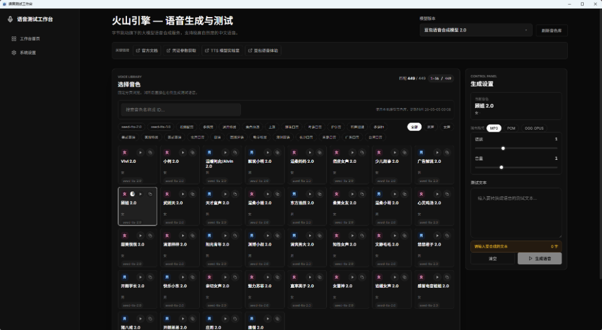

# VoiceOps (AI Voice Service Demo) 🎙️

<div align="center">

[](LICENSE)
[](https://dotnet.microsoft.com/)
[]()

**一个面向桌面端的多厂商 TTS 音色测试、语气控制与语音生成工作台。**

[🇺🇸 English Version](README_en.md) | **🇨🇳 简体中文**

</div>

---

## 项目预览



## 项目定位

VoiceOps 是一个基于 **.NET 8 + WPF + BlazorWebView** 构建的本地桌面端 TTS 工具。它的目标不是只封装一个接口，而是帮助开发者和内容生产者在同一个界面里完成多厂商凭证配置、音色拉取、音色试听、参数调节、语气/SSML 标注和语音生成验证。

当前开发重点是 **桌面端体验与本地自动化接口并行**：桌面软件内置受 Bearer Token 保护的 REST API，可被 Dify、脚本和其他本机程序直接调用。仓库中的 MCP 服务是独立旧实现，后续再继续收敛。

## 当前能力

### 多厂商 TTS 工作台

| 厂商 | 桌面端状态 | 音色能力 | 语气/SSML |
| --- | --- | --- | --- |
| 火山引擎 | 已接入 | 支持在线/缓存音色，支持 BigTTS 音色元数据 | 支持按音色 emotion 参数选择语气 |
| OpenAI | 已接入 | 内置官方常用音色 | 暂按模型文本指令表达情绪 |
| Microsoft Azure | 已接入 | 支持在线音色列表 | 支持普通文本 speaking style，也支持完整 SSML 输入 |
| 腾讯云 | 已接入 | 支持在线音色列表与内置兜底 | 支持 EmotionCategory 与强度 |
| 阿里云 CosyVoice | 已接入 | 使用本地/厂商音色数据 | 暂未做厂商级语气面板 |
| 百度智能云 | 已接入 | 内置基础音色 | 暂未做厂商级语气面板 |
| Google TTS | 已接入 | 支持在线音色列表 | 支持标准 SSML |
| 小米 MiMo | 已接入 | 内置官方音色 | 支持模型朗读指导 |
| MiniMax | 已接入 | 支持在线音色列表 | 支持基础语速/音量参数 |
| ElevenLabs | 已接入 | 支持在线音色列表 | 支持多种音频输出格式 |
| Fish Audio | 已接入 | 支持在线模型/音色列表 | 支持多种音频输出格式 |
| Deepgram | 已接入 | 支持在线 Aura 模型列表 | 支持 Aura 语速与多格式输出 |
| Cartesia | 已接入 | 支持分页在线音色列表与试听字段 | 支持普通文本内联标签子集、速度、音量与 Sonic 情感控制 |
| PlayHT | 已接入 | 支持官方 `id` 在线预置音色列表 | 支持 Play3.0/PlayDialog/PlayHT 2.0、速度与五种音频格式；Turbo 待专用约束建模 |
| Amazon Polly | 已接入 | 支持 DescribeVoices 在线分页音色列表 | 支持普通文本、SSML、四种引擎与 MP3/Ogg Vorbis/PCM |

桌面端当前统一注册 **15 家**厂商。厂商能力会同时出现在工作区和本地 REST API 的 `/api/v1/vendors` 响应中。

### 桌面端交互

- 供应商切换后自动匹配该厂商的语速、音量范围、步长和默认值。
- 支持音色搜索、分页、标签展示、示例音频播放和生成结果回放。
- 支持生成后复制输出路径，并把音频文件保存到本地输出目录。
- 设置页已经改为长期可见字段标签，不再依赖 placeholder 才知道输入框含义。
- 火山引擎和腾讯云凭证已经拆成结构化字段，避免普通用户手写长串 `|` 分隔凭证时填错。
- 凭证输入支持显示/隐藏、字段说明、获取入口和连通性测试。

### 语气与 SSML

- Azure：
  - 普通文本模式下可选择 speaking style，并调节 style degree。
  - SSML 模式下可直接输入完整 `<speak>...</speak>`，适合测试停顿、韵律、角色、风格等高级标注。
- 火山引擎：
  - 对带情感元数据的音色展示可选语气。
  - 对 BigTTS/BV 类音色提供默认语气选项兜底。
  - 生成请求会把选中的 emotion 写入火山协议请求体。

### 厂商协议与签名

- 腾讯云 API 3.0 `TC3-HMAC-SHA256` 请求签名。
- 火山引擎 HMAC-v1 / V3 请求字段构造。
- Amazon Polly `AWS4-HMAC-SHA256`（SigV4）区域化请求签名，临时凭证会签入 Session Token。
- Azure REST TTS SSML 包装与转义。
- 各厂商请求参数按本地统一模型映射，减少前端直接关心厂商差异。

### 运行稳定性与异常诊断

- **WebView2 隔离优化**：针对受限系统权限或安全软件拦截，自动将 WebView2 的用户数据文件夹（UDF）重定向至系统临时的 `TEMP\VoiceOps_WebView2` 目录下，彻底防范了因默认 exe 目录下无写入权限而引起的初始化闪退问题。
- **全局未处理异常捕获**：在 `App` 级订阅了 `AppDomain` 和 `Dispatcher` 的未处理异常。一旦程序运行或初始化发生崩溃，会自动弹出错误框，并将详细堆栈信息记录在运行目录的 `crash.txt` 中，便于开发调试和日常问题排查。

### 本地 REST API 与 Dify

- API 默认随桌面软件启动，监听 `http://127.0.0.1:5055`；端口、启停和 Docker/局域网访问可在设置页调整。
- `GET /health` 与 `GET /openapi/v1.json` 可匿名访问；其余 `/api/v1/*` 路由要求设置页生成的 Bearer Token。
- `POST /api/v1/tts` 返回 JSON 元数据和受保护的音频下载地址。
- `POST /api/v1/tts/audio` 直接返回音频字节，适合支持文件响应的 HTTP 工作流。
- API 复用桌面端 15 家 Provider、已保存凭证和输出目录，请求体不接受厂商密钥。
- Dify Docker 使用 `host.docker.internal`；Dify Cloud 需要额外的 HTTPS 隧道、VPN 或反向代理，不能直接访问本机 localhost。

完整配置、curl 和 Dify 示例见 [Dify 本地 TTS API 接入指南](Docs/guides/DIFY_LOCAL_TTS_API.md)。

## 快速开始

### 环境要求

- Windows 10/11
- [.NET 8 SDK](https://dotnet.microsoft.com/download/dotnet/8.0)

### 编译和运行

```bash
git clone https://github.com/zzf-857/VoiceServiceDemo.git
cd VoiceServiceDemo
dotnet build VoiceServiceDemo.slnx
dotnet run --project VoiceServiceDemo.csproj
```

如果只想快速启动桌面端，也可以在仓库根目录执行：

```bash
dotnet run
```

### 运行自检

```bash
dotnet test VoiceServiceLocalApi.Tests/VoiceServiceLocalApi.Tests.csproj --no-restore
dotnet run --project VoiceServiceDemo.Tests/VoiceServiceDemo.Tests.csproj --no-restore
dotnet build VoiceServiceDemo.slnx --no-restore
```

当前自检覆盖本地 HTTP 契约、鉴权、并发与文件安全、真实 Kestrel 生命周期、烟测脚本、15 家 Provider 请求边界、设置持久化和设置页体验标记。

## 凭证配置

运行软件后进入“系统设置”页面，按厂商填写凭证。设置页会显示每个字段的固定标签和说明，保存后即可进入对应工作区测试音色和生成。

常用格式如下：

| 厂商 | 凭证格式 |
| --- | --- |
| 火山引擎 | 基础生成填写 `AppID` 和 `Access Token`；高级能力可补充 `Cluster`、`AK`、`SK`、`V3 API Key`、`ResourceId` |
| 腾讯云 | `AppID` 可选记录；生成语音需要 `SecretId` 和 `SecretKey` |
| Azure | `subscription_key|region`，例如 `key|eastasia` |
| 百度智能云 | `api_key|secret_key` |
| OpenAI | OpenAI API Key |
| Google | Google Cloud Text-to-Speech API Key |
| 阿里云 | DashScope API Key |
| 小米 MiMo | `MIMO_API_KEY` |
| MiniMax | `MINIMAX_API_KEY` |
| ElevenLabs | `ELEVENLABS_API_KEY` |
| Fish Audio | `FISH_AUDIO_API_KEY` |
| Deepgram | `DEEPGRAM_API_KEY` |
| Cartesia | `CARTESIA_API_KEY` |
| PlayHT | `PLAYHT_USER_ID|PLAYHT_API_KEY` |
| Amazon Polly | `access_key_id|secret_access_key|region[|session_token]`；前三段必填，使用临时凭证时追加 Session Token |

> 说明：当前版本仍以本地配置为主，适合开发和测试环境。若要用于长期生产环境，后续需要继续加强本地密钥加密、权限隔离和团队级凭证管理。

## 使用建议

1. 先在“系统设置”里配置目标厂商凭证，并使用“测试连接”确认凭证可用。
2. 进入目标厂商工作区，优先点击“刷新音色”获取最新音色数据。
3. 选择音色并试听示例音频，确认音色风格。
4. 根据厂商能力调节语速、音量、Azure style 或火山语气。
5. 输入文本或 SSML，点击“生成语音”查看本地音频结果。

## 目录结构

```text
VoiceServiceDemo/
 ├── VoiceServiceDemo.slnx   # 解决方案入口，包含桌面端、MCP、共享库和自检项目
 ├── Components/             # Blazor 前端视图与页面交互组件
 ├── Helpers/                # 桌面端辅助类与凭证解析
 ├── Models/                 # 实体类、厂商配置和统一 TTS 请求模型
 ├── Services/               # 桌面端 TTS 业务服务与厂商 Provider
 ├── VoiceServiceShared/     # 桌面端和 MCP 端共享的协议、凭证、请求构造逻辑
 ├── VoiceServiceLocalApi/   # 桌面进程内托管的本地 REST API 核心
 ├── VoiceServiceLocalApi.Tests/ # REST API 的标准 xUnit 集成测试
 ├── VoiceServiceMcp/        # 独立旧版 MCP 服务端，与桌面 REST API 分开运行
 ├── VoiceServiceDemo.Tests/ # 桌面 Provider 与 UI 标记自检项目
 ├── Docs/                   # 项目文档、供应商接入资料、优化清单和实现计划
 ├── data/                   # 供应商原始数据或解析后的静态数据
 ├── scripts/                # 辅助脚本
 ├── assets/                 # 图标、截图等非代码资源
 └── wwwroot/                # 静态资源、CSS 样式、音频互操作 JS
```

更详细的项目地图见 [Docs/project/PROJECT_STRUCTURE.md](Docs/project/PROJECT_STRUCTURE.md)。

## 近期优化方向

当前项目的完整功能缺口清单见 [Docs/project/TTS_TOOL_GAP_CHECKLIST_2026-05-02.md](Docs/project/TTS_TOOL_GAP_CHECKLIST_2026-05-02.md)。优先级较高的方向包括：

- 扩展更多厂商的在线音色拉取和示例音频数据。
- 为阿里云、腾讯云、Google 等厂商补齐可视化语气/风格能力。
- 增强 SSML 编辑体验，例如模板、预览、片段插入和合法性校验。
- 增加生成历史、批量生成、任务队列和失败重试。
- 在桌面端能力稳定后再统一 MCP 的 schema、注册表和厂商能力声明。

## 开源协议

本项目采用 MIT 开源协议，详情请查看 [LICENSE](LICENSE) 文件。
